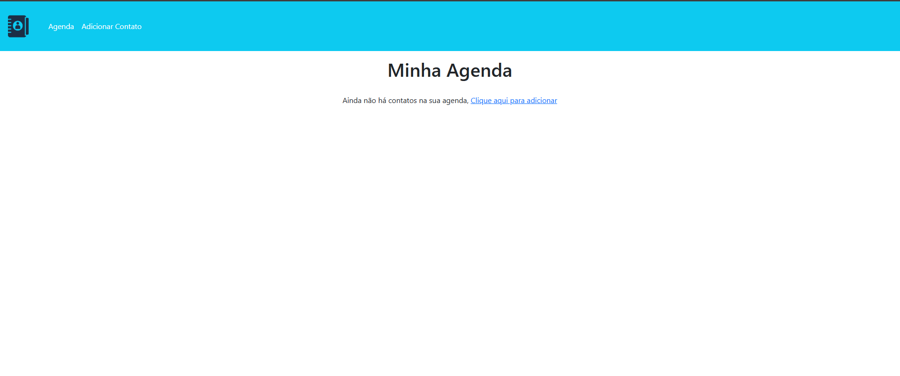
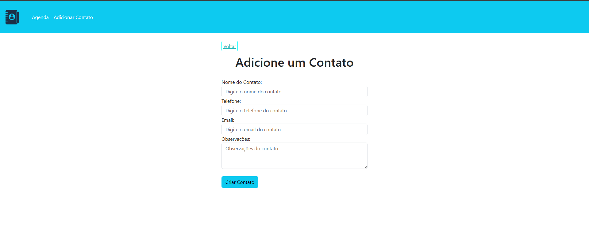
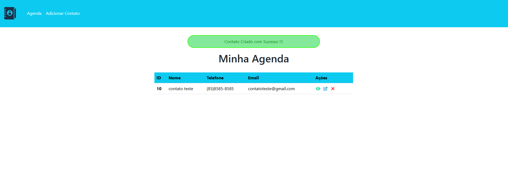
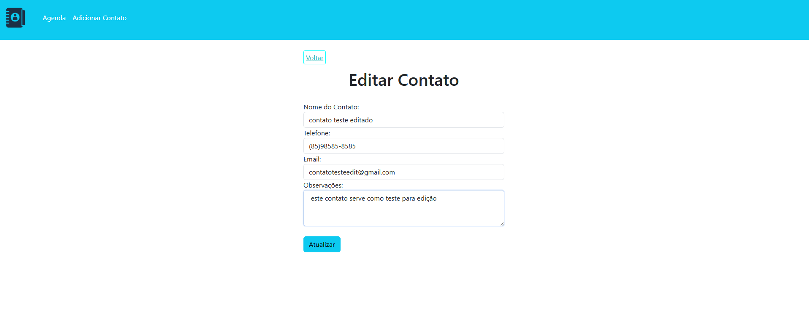
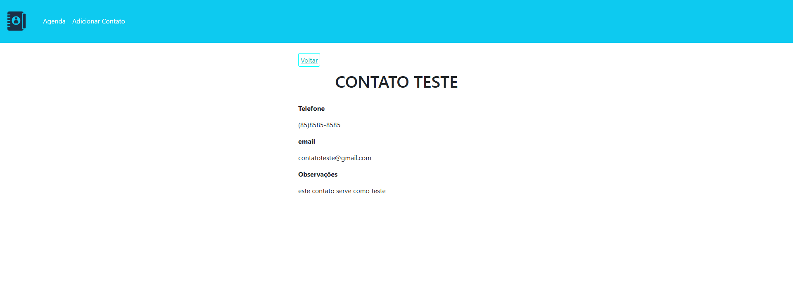

# 📒 Agenda de Contatos – Projeto do Curso Udemy


> 📌 Sistema simples de agenda de contatos desenvolvido em PHP, com CRUD completo e layout responsivo utilizando Bootstrap.

---

## 🖼 Demonstração
> **
> **
> **
> **
> **

---

## 🗂 Detalhamento dos Arquivos

### **Arquivos principais**
- **`home.php`** – 📜 Página inicial que lista todos os contatos cadastrados.
- **`create.php`** – ➕ Formulário para adicionar um novo contato.
- **`edit.php`** – ✏️ Formulário para editar um contato existente.
- **`contato.php`** – 🔍 Página para visualizar os detalhes de um contato.

### **Pasta `config/`** – ⚙️ Configuração e backend
- **`connection.php`** – Conexão com o banco de dados MySQL.
- **`process.php`** – Processa as requisições do CRUD (criar, editar, excluir).
- **`url.php`** – Define a URL base do projeto.

### **Pasta `css/`**
- **`styles.css`** – 🎨 Estilo visual personalizado.

### **Pasta `img/`**
- **`logo.png`** – 🖼 Logotipo do projeto.

### **Pasta `templates/`**
- **`header.php`** – 🏷 Cabeçalho padrão.
- **`footer.php`** – 📌 Rodapé padrão.
- **`backbtn.html`** – 🔙 Botão de voltar.

---

## 🛠 Tecnologias Utilizadas
- **PHP** – Backend e lógica da aplicação  
- **MySQL** – Banco de dados  
- **HTML5 & CSS3** – Estrutura e estilo  
- **Bootstrap 5** – Layout responsivo  
- **XAMPP** – Servidor local de desenvolvimento  

---

## 🚀 Como Executar

1. **Clonar o repositório**
   ```bash
   git clone https://github.com/jhammes-dev/agenda-curso-udemy.git
   ```
2. **Acessar a pasta**
   ```bash
   cd agenda-curso-udemy
   ```
3. **Configurar o banco**
   - Criar um banco MySQL.
   - Importar o arquivo `.sql` do projeto (se existir).
   - Ajustar `config/connection.php` com as credenciais corretas.

4. **Rodar no servidor local**
   - Iniciar XAMPP ou similar.
   - Acessar no navegador:
     ```
     http://localhost/agenda-curso-udemy/home.php
     ```

---

## 📌 Funcionalidades
✔️ Cadastro de contatos  
✔️ Listagem de contatos  
✔️ Visualização de detalhes  
✔️ Edição de contatos  
✔️ Exclusão de contatos  
✔️ Layout responsivo com Bootstrap  

---